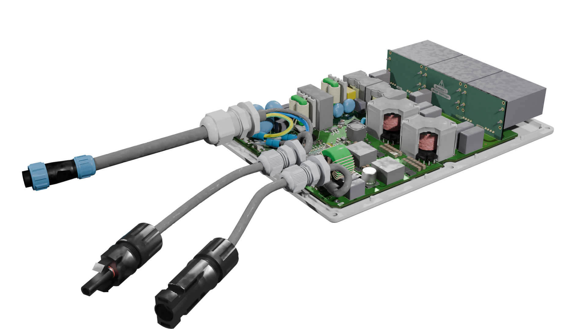
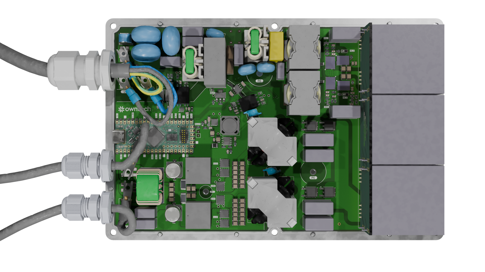
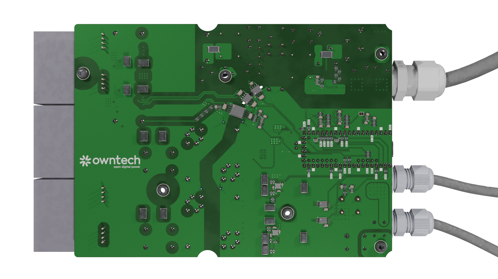
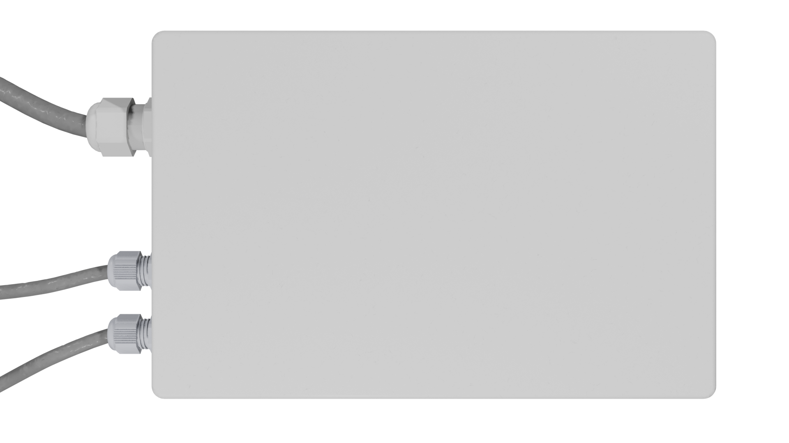

# An open-source - community built micro-inverter

## Manifesto 

The project goal are : 

- Having the first open source PV micro-inverter
- Finally a design easy to repair that is no longer a black box
- Redeem your data sovereignty, you will no longer depend on a proprietary cloud to follow your solar production and consumption. 

## Open, for everyone, forever

- This project is propulsed by its community. 
- The collective work generated is meant to remain open. 
- Design files are made with open source software - Namely kiCAD.
- Mechanical interfaces and components are modeled using FreeCAD.
- Simulation files use ngSpice.

In that sense, the owntech foundation aims at protecting this technical common.

## Specifications
This section is inspired from 

Comparison of micro-inverters with rated output power between 350VA and 400VA:

| Model                                  | HM-350 | HM-400 | IQ7A |EVT300  |TSOL-M800  |
|:---------------------------------------|:-----------:|:-----------:|:-----------:|:-------------:|:---------------:|
| Manufacturer                           | Hoymiles    | Hoymiles    | Enphase     | Envertech     |    TSUN         |
| Number of solar panels                 | 1           | 1           | 1           | 1             | 2               |
| Recommended input power (W)            | 280-470+    | 320-540+    | 295-460     | 180-420+      |2 $\cdot$ 280-440|
| $V_{MPPT,min}$ (V)                     | 33          | 34          | 38 (18)     | 24            | 33              |
| $V_{MPPT,max}$ (V)                     | 48          | 48          | 43 (58)     | 45            | 48              |
| Start-up voltage (V)                   | 22          | 22          | 22          | -             | -               |
| Operating volage range (V)             | 16-60       | 16-60       | 16-58       | 18-54         | 16-60           |
| Maximum input current (A)              | 11.5        | 12          | 12          | 12            | 11.5            |
| Maximum input short circuit current (A)| 15          | 15          | 20          | 15            | 15              |
| Rated output power (VA)                | 350         | 400         | 349         | 300           | 600             |
| Peak efficiency (%)                    | 96.7        | 96.7        | 97.7        | 95.4          | 96.7            |
| CEC weighted efficiency (%)            | 96.5        | 96.5        | 97.0        | 95.0          | 96.5            |

Subject to further modifications, the micro-inverter should have the following specifications:
- 230V 50Hz AC grid code compliant
- Efficiency > 95%
- Operating range: 16V - 58V
- Input power from solar panel: 350W - 550W
- Power: 450VA with possibility of software limitation.
- Power factor ≈ 1
- Total Harmonic Distortion (THD) < 5%.
- Electrical isolation between solar module and grid voltage
- Temperature range: -40 °C to 60 °C
- No invasive potting that prevents reparability
- Interfaces:
  - WIFI

## Renderings

## Contribute 

### Spread the word

- ⭐ Star this repository  

- Share the project with PV / power electronics / open-hardware communities  

- Mention it in meetups, forums, maker spaces, or your local energy co-op  

### Give feedback and report issues

Help us improve by opening GitHub issues:

- Bug reports (schematic/PCB mistakes, BOM mismatches, mechanical interferences)  

- Documentation gaps (unclear steps, missing diagrams, confusing naming)  

- Feature requests  

### Choose a contribution path

Start with  — a living list of work items the community can pick up.  
Whether you’re a student looking for a thesis topic, an engineer wanting to review a safety-critical design, or a maker growing skills in hardware and firmware: you’re welcome here.  

Bring what you have: time, curiosity, test equipment, careful eyes, lived experience installing or repairing PV gear.  
Let’s build an inverter that isn’t a black box — and keep it open, for everyone, forever.  

## Standards and directives

### Application related standards

- IEC 62109: Safety requirements for photovoltaic inverters.
- IEC 61727: Requirements for photovoltaic (PV) systems to interface with the utility grid.
- IEC 62116: Test procedure for islanding prevention measures for utility-interconnected photovoltaic inverters.
- EN 50438: Requirements for the connection of micro-generators in parallel with public low-voltage distribution networks.
- EN 50549: Requirements for generating plants to be connected in parallel with distribution networks (superseeds DIN VDE 0126)

## Licence 

This project is licenced under **CERN-OHL-V2-S** open source hardware licence. Licence file can be found under `License/cern-ohl-v2-s`. 
 

