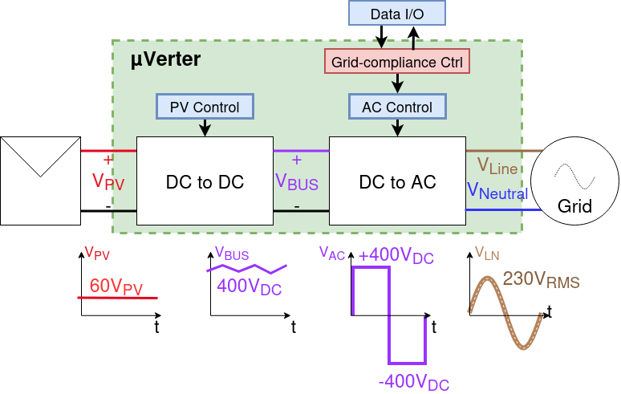

# An open-source - community built micro-inverter

## Manifesto 

The project goal are : 

- Having the first open source PV micro-inverter
- Finally a design easy to repair that is no longer a black box
- Redeem your data sovereignty, you will no longer depend on a proprietary cloud to follow your solar production and consumption. 

## Open, for everyone, forever

- This project is propulsed by its community. 
- The collective work generated is meant to remain open. 
- Design files are made with open source software - Namely kiCAD.
- Mechanical interfaces and components are modeled using FreeCAD.
- Simulation files use ngSpice.

In that sense, the owntech foundation aims at protecting this technical common.

## Specifications
This section is inspired from 

Comparison of micro-inverters with rated output power between 350VA and 400VA:

| Model                                  | HM-350 | HM-400 | IQ7A |EVT300  |TSOL-M800  |
|:---------------------------------------|:-----------:|:-----------:|:-----------:|:-------------:|:---------------:|
| Manufacturer                           | Hoymiles    | Hoymiles    | Enphase     | Envertech     |    TSUN         |
| Number of solar panels                 | 1           | 1           | 1           | 1             | 2               |
| Recommended input power (W)            | 280-470+    | 320-540+    | 295-460     | 180-420+      |2 $\cdot$ 280-440|
| $V_{MPPT,min}$ (V)                     | 33          | 34          | 38 (18)     | 24            | 33              |
| $V_{MPPT,max}$ (V)                     | 48          | 48          | 43 (58)     | 45            | 48              |
| Start-up voltage (V)                   | 22          | 22          | 22          | -             | -               |
| Operating volage range (V)             | 16-60       | 16-60       | 16-58       | 18-54         | 16-60           |
| Maximum input current (A)              | 11.5        | 12          | 12          | 12            | 11.5            |
| Maximum input short circuit current (A)| 15          | 15          | 20          | 15            | 15              |
| Rated output power (VA)                | 350         | 400         | 349         | 300           | 600             |
| Peak efficiency (%)                    | 96.7        | 96.7        | 97.7        | 95.4          | 96.7            |
| CEC weighted efficiency (%)            | 96.5        | 96.5        | 97.0        | 95.0          | 96.5            |

### uVerter Target specifications

| Category | Requirement | Notes |
|---|---:|---|
| Grid | 230 V AC / 50 Hz | Designed for EU-style grids |
| Grid compliance | Grid-code compliant | Exact certification scope depends on country / standard |
| Rated apparent power | 450 VA | Software-limited power cap supported |
| Input DC operating range | 16 V – 58 V | PV module operating window |
| Recommended PV input power | 350 W – 550 W | Depends on module and thermal conditions |
| Efficiency | > 95% | Target at nominal conditions |
| Power factor | ≈ 1 | Near-unity PF at rated power |
| THD | < 5% | Total harmonic distortion at rated conditions |
| Isolation | Galvanic isolation | Electrical isolation between PV and grid |
| Operating temperature | -40 °C to +60 °C | Derating may apply |
| Repairability | No invasive potting | Designed to be serviceable / inspectable |
| Connectivity | Wi-Fi | Local-first monitoring (no proprietary cloud required) |

## Renderings

## Control overview

The control overview shows the uVerter as two coordinated stages: a PV-controlled DC/DC front end that regulates the panel operating point and raises the DC bus, followed by an AC control stage that shapes a grid-compliant AC output. Measurements and commands flow through Data I/O and the grid-compliance controller so the inverter can synchronize to line/neutral, limit harmonics, and maintain safe operation while power flows from the PV input to the grid.

## Firmware overview

The `firmware/src/main.cpp` file is the entry point for the uVerter firmware: it configures the sensors and power stages, sets up the real-time and background tasks, and runs the state machine plus control loops that drive the boost and inverter legs based on measurements and synchronization status.

- Real-time control runs in `loop_critical_task()` at 100 µs to read sensors, enforce protections, regulate the boost stage, compute duty cycles, and update grid-sync variables.
- Supervisory logic runs in `loop_application_task()` to manage modes (idle/startup/power/error), handle transitions, and expose telemetry through the user data API.

### Compiling

Micro-inverter uses [PlatformIO](https://platformio.org/) as it's build and dependency management system.

#### From the command line

1. Create and activate a Python virtual environment.

        python3 -m venv .owntech-venv
        source .owntech-venv/bin/activate

2. Install PlatformIO.

        pip3 install platformio

3. Compile the code. Dependencies (including Zephyr and Owntech libraries) are downloaded automatically.

        cd micro-inverter/firmware/
        pio run

#### In Visual Studio Code

1. Install the "PlatformIO IDE" extension
2. Open the `firmware` directory via PlatformIO's home screen (**not** with VSCode's File -> Open)
3. Press the "Build" button in the PlatformIO toolbar (found on the bottom left)

## Contribute 

### Spread the word

- ⭐ Star this repository  

- Share the project with PV / power electronics / open-hardware communities  

- Mention it in meetups, forums, maker spaces, or your local energy co-op  

### Give feedback and report issues

Help us improve by opening GitHub issues:

- Bug reports (schematic/PCB mistakes, BOM mismatches, mechanical interferences)  

- Documentation gaps (unclear steps, missing diagrams, confusing naming)  

- Feature requests  

### Choose a contribution path

Start with  — a living list of work items the community can pick up.  
Whether you’re a student looking for a thesis topic, an engineer wanting to review a safety-critical design, or a maker growing skills in hardware and firmware: you’re welcome here.  

Bring what you have: time, curiosity, test equipment, careful eyes, lived experience installing or repairing PV gear.  
Let’s build an inverter that isn’t a black box — and keep it open, for everyone, forever.  

## Safety first  

### Disclaimer
This project is shared as-is, without any warranty of any kind, and without any guarantee of compliance with safety, EMC, or grid-connection regulations.
By building, modifying, or using this design, you accept full responsibility for verification, testing, certification (if applicable), and safe operation.

Do not connect a prototype to the public grid.
Grid connection must only happen after appropriate validation, protections, and (where required) third-party certification.

### Mind the risks  
Building a micro-inverter is an advanced DIY project. It combines high energy, high voltage, fast switching, and grid interaction — a mix that can injure, start fires, or damage property

Key hazards include:

- Electric shock and electrocution
Internal stages can reach hundreds of volts. Multiple nets are high voltage. Some capacitors can stay charged after power-off. Treat the system as live until proven discharged and measured.

- Fire and thermal runaway
Faults can turn traces, connectors, inductors, or semiconductors into heaters in seconds. Thermal issues can escalate quickly.

### A community note
We want this project to be open — not reckless. If you spot a safety issue (creepage/clearance, insulation, thermal margins, protection logic, connector ratings, etc.), please report it.
Safety improvements are contributions that protect everyone.

## Standards and directives

### Application related standards

- IEC 62109: Safety requirements for photovoltaic inverters.
- IEC 61727: Requirements for photovoltaic (PV) systems to interface with the utility grid.
- IEC 62116: Test procedure for islanding prevention measures for utility-interconnected photovoltaic inverters.
- EN 50438: Requirements for the connection of micro-generators in parallel with public low-voltage distribution networks.
- EN 50549: Requirements for generating plants to be connected in parallel with distribution networks (superseeds DIN VDE 0126)

## Licence 

This project is licenced under **CERN-OHL-V2-S** open source hardware licence. Licence file can be found under `License/cern-ohl-v2-s`. 
 

